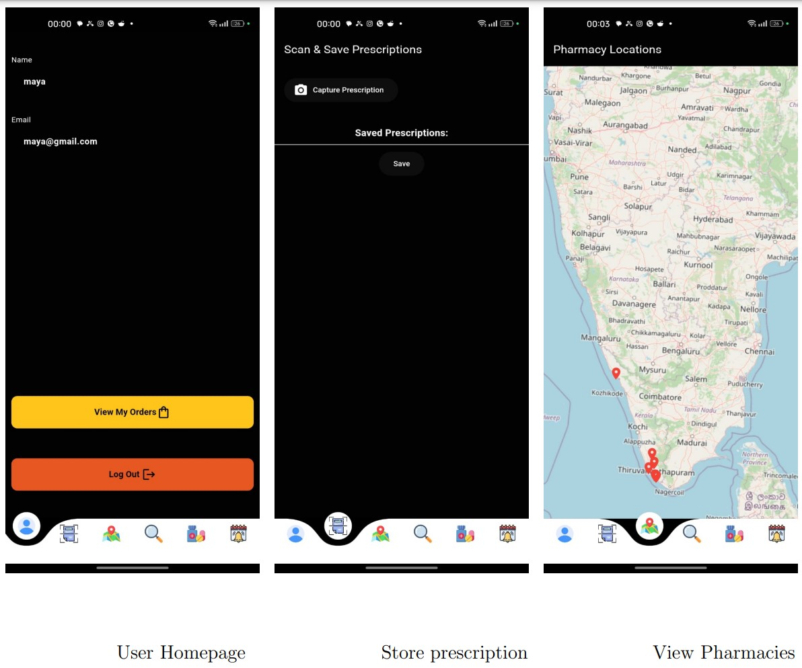

A few resources to get you started if this is your first Flutter project:

- [Lab: Write your first Flutter app](https://docs.flutter.dev/get-started/codelab)
- [Cookbook: Useful Flutter samples](https://docs.flutter.dev/cookbook)

# PharMap

**PharMap** is a comprehensive Flutter app designed to help you find pharmacies near you and manage your medicines with ease. Featuring a medicine reminder to keep you on track, PharMap is your go-to app for pharmacy needs and health management.

## Key Features:
- **Find Nearby Pharmacies:** Locate pharmacies around you with ease using our GPS-enabled search.
- **Medicine Management:** Track and manage your medicines effectively.
- **Medicine Reminders:** Set up reminders to never miss a dose.
- **User-Friendly Interface:** Simple and intuitive design for seamless navigation.

## Screenshots:

1. **Login, SignUp** 
   
   
3. **User Screen:** 
   

4. **User Screen:** 
   

5. **Pharmacist Screen:** 
   

6. **Pharmacist Screen:** 
   

## DFD:

1. **User DFD:** 
   
   
3. **User DFD:** 
   


## Database Schema(SUPABASE):

(Change the database URL, KEY)

**profile Table:**

```bash
create table
  public.profile (
    id bigint generated by default as identity not null,
    created_at timestamp with time zone not null default now(),
    usertype character varying null,
    emailid character varying null,
    "UUID" uuid not null default auth.uid (),
    username character varying null,
    city text null,
    constraint profile_pkey primary key (id, "UUID"),
    constraint profile_UUID_key unique ("UUID")
  ) tablespace pg_default;
```

**prescription Table:**
```bash
create table
  public.prescription (
    id bigint generated by default as identity not null,
    created_at timestamp with time zone not null default now(),
    image_url text null,
    uuid uuid null default gen_random_uuid (),
    constraint prescription_pkey primary key (id)
  ) tablespace pg_default;
```
**pharmacy_medicines Table:**
```bash
create table
  public.pharmacy_medicines (
    id serial not null,
    pharmacy_id integer null,
    medicine_id integer null,
    constraint pharmacy_medicines_pkey primary key (id),
    constraint pharmacy_medicines_medicine_id_fkey foreign key (medicine_id) references medicines (id),
    constraint pharmacy_medicines_pharmacy_id_fkey foreign key (pharmacy_id) references pharmacies (id)
  ) tablespace pg_default;
```

**pharmacies Table:**
```bash
create table
  public.pharmacies (
    id serial not null,
    name text not null,
    longitude real not null,
    latitude real not null,
    owner_name text null,
    phone_number text null,
    uuid uuid null,
    city text null,
    close_time time without time zone null,
    open_time time without time zone null,
    constraint pharmacies_pkey primary key (id)
  ) tablespace pg_default;
```

**orders Table:**
```bash
create table
  public.orders (
    id serial not null,
    user_id uuid null,
    pharmacy_id integer null,
    medicine_name character varying(100) null,
    price integer null,
    order_status character varying(50) null default 'Pending'::character varying,
    longitude numeric null,
    latitude numeric null,
    created_at timestamp without time zone null default current_timestamp,
    quantity bigint null,
    "Address" text null,
    "OrderOTP" numeric null,
    pharmacy_name text null,
    username text null,
    constraint orders_pkey primary key (id),
    constraint orders_pharmacy_id_fkey foreign key (pharmacy_id) references pharmacies (id),
    constraint orders_user_id_fkey foreign key (user_id) references profile ("UUID")
  ) tablespace pg_default;
```

**messages Table:**
```bash
create table
  public.messages (
    id uuid not null default gen_random_uuid (),
    created_at timestamp with time zone not null default now(),
    profile_id uuid null,
    content text null,
    user_to uuid null,
    constraint messages_pkey primary key (id)
  ) tablespace pg_default;
```

**medicines Table:**
```bash
create table
  public.medicines (
    id serial not null,
    generic_id integer null,
    brand_name character varying(255) not null,
    description text null,
    generic_name text null,
    price real null,
    constraint medicines_pkey primary key (id),
    constraint medicines_generic_id_brand_name_key unique (generic_id, brand_name)
  ) tablespace pg_default;
```

**generics Table:**
```bash
create table
  public.generics (
    id serial not null,
    name character varying(255) not null,
    constraint generics_pkey primary key (id),
    constraint generics_name_key unique (name)
  ) tablespace pg_default;
```

